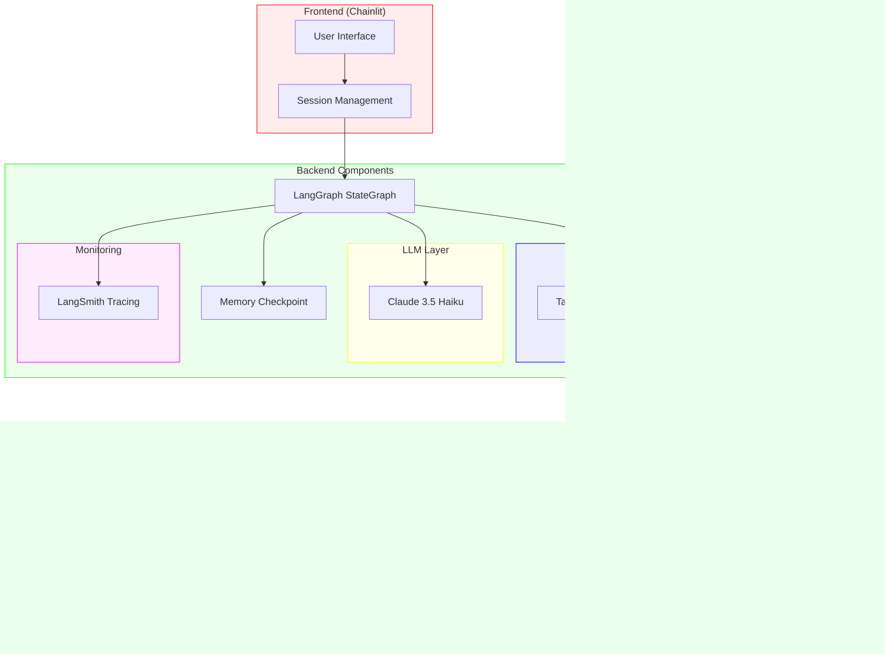

```mermaid
flowchart TB
    %% Frontend Section
    subgraph Frontend["Frontend (Chainlit)"]
        UI["User Interface"]
        SessionMgmt["Session Management"]
    end

    %% Backend Section
    subgraph Backend["Backend Components"]
        LangGraph["LangGraph StateGraph"]
        MemorySaver["Memory Checkpoint"]
        
        subgraph Tools["Tools Layer"]
            TavilySearch["Tavily Search API"]
        end
        
        subgraph LLM["LLM Layer"]
            Claude["Claude 3.5 Haiku"]
        end
        
        subgraph Monitoring["Monitoring"]
            LangSmith["LangSmith Tracing"]
        end
    end

    %% Message Flow
    Start(("Start")) --> UserMsg["User Message"]
    UserMsg --> GraphProcess["Process in StateGraph"]
    GraphProcess --> ToolCheck{"Need Tools?"}
    ToolCheck -->|Yes| SearchExec["Execute Search"]
    ToolCheck -->|No| LLMProcess["LLM Processing"]
    SearchExec --> LLMProcess
    LLMProcess --> Response["Generate Response"]
    Response --> End(("End"))

    %% Connections
    UI --> SessionMgmt
    SessionMgmt --> LangGraph
    LangGraph --> MemorySaver
    LangGraph --> TavilySearch
    LangGraph --> Claude
    LangGraph --> LangSmith

style Frontend fill:#ffecec,stroke:#ff0000
style Backend fill:#ecffec,stroke:#00ff00
style Tools fill:#ececff,stroke:#0000ff
style LLM fill:#ffffec,stroke:#ffff00
style Monitoring fill:#ffecff,stroke:#ff00ff
```